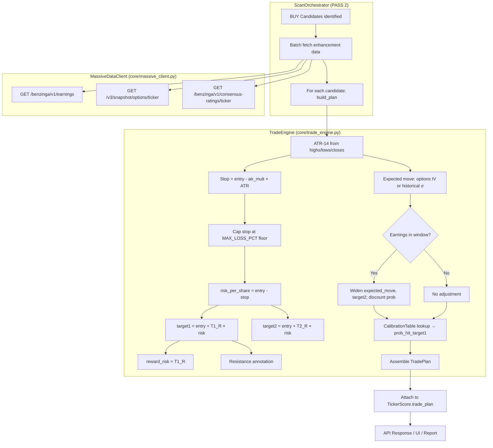
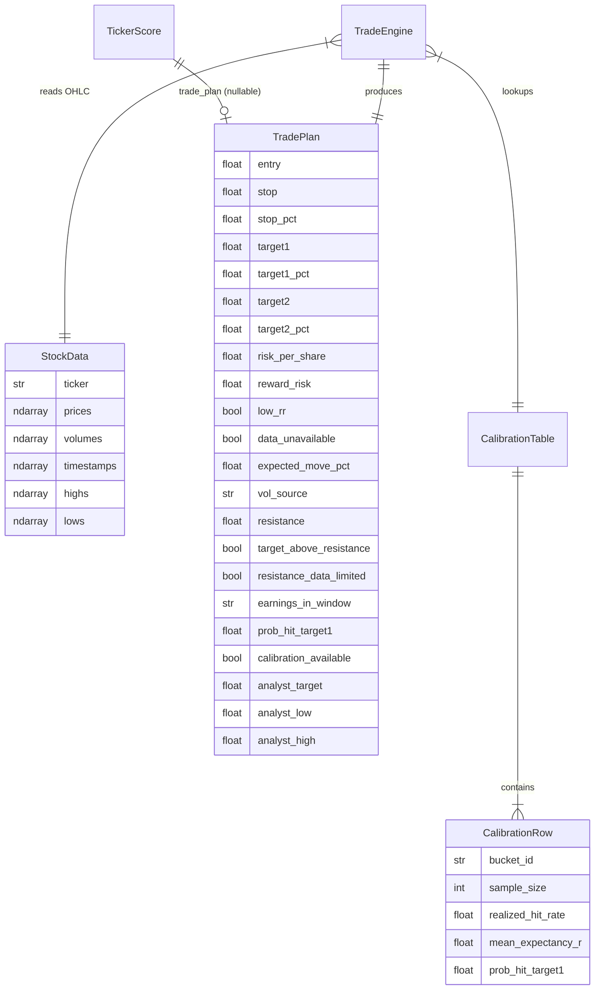

# Trade Engine — Design Document

## Overview

The Trade Engine transforms BUY candidates from the V3 scanner into concrete, risk-defined equity trade plans. For each candidate that passes Minervini hard filters and scores above the regime threshold, the engine computes a volatility-based stop-loss, R-multiple profit targets, a 30-day expected move, a resistance annotation, a reward:risk quality gate, an earnings-in-window warning with target widening, and a calibrated probability of hitting the primary target.

The engine is designed as a **pure, deterministic function** of its inputs (OHLC arrays + optional enhancement data), making it fully unit-testable and back-testable without network access. Data flows in two tiers:

- **Core (always available, from OHLC):** ATR stop, R-multiple targets, historical expected move, resistance cap, reward:risk ratio. This tier never fails if sufficient price history exists.
- **Enhancements (Massive API, degrade gracefully):** Earnings-in-window flag with target widening, options-implied volatility, analyst consensus anchor. Any failure → fall back silently, never block plan generation.

The Trade Engine hooks into the existing orchestrator at PASS 2, computing plans only for the candidate set (typically 8–25 tickers), keeping API cost bounded.

## Architecture



### Data Flow Summary

1. **Orchestrator PASS 2** identifies BUY candidates (passed hard filters + score ≥ regime threshold)
2. **MassiveDataClient** fetches earnings, options chain, analyst consensus for candidate batch only
3. **TradeEngine.build_plan** receives OHLC + optional enhancement data, returns a `TradePlan`
4. **TradePlan** is attached to `TickerScore.trade_plan` for API response, UI rendering, and report download
5. Failures at any enhancement step → graceful degradation (plan still produced with core data)

### Key Design Decisions

| Decision | Rationale |
|----------|-----------|
| Pure function design for TradeEngine | Enables deterministic testing and backtesting without mocks |
| Enhancement data passed as optional args | Decouples I/O (Massive calls) from computation (plan math) |
| Plans only for candidates (R11) | Bounds API cost to ~8-25 Massive calls per scan, not 100+ |
| Calibration table loaded at startup | Runtime lookup is O(1); never computed ad hoc (R7) |
| Separate MassiveDataClient from RestApiClient | Different endpoints, different retry semantics, clear responsibility boundary |

## Components and Interfaces

### 3.1 StockData Extension (R12) — `core/models.py`

Extend `StockData` with `highs` and `lows` arrays populated from existing Polygon bar response.

```python
@dataclass
class StockData:
    """Raw stock data from API."""
    ticker: str
    prices: np.ndarray      # Close prices (float64)
    volumes: np.ndarray     # Volumes (float64)
    timestamps: np.ndarray  # Unix timestamps (int64)
    highs: np.ndarray       # High prices (float64) — NEW
    lows: np.ndarray        # Low prices (float64)  — NEW
```

The `RestApiClient.fetch_stock_data` already receives `h` and `l` fields from each Polygon bar but currently discards them. The change populates `highs` from `bar["h"]` and `lows` from `bar["l"]` in the same loop that extracts `prices` and `volumes`.

**Backward compatibility:** Existing indicator/scoring code does not reference `highs`/`lows`, so no breakage. Existing tests pass unchanged.

### 3.2 TradeConfig — `config.py`

Configuration parameters for the trade engine, added to the existing `Config` class:

```python
# Trade Engine Configuration (added to Config class in config.py)
# ATR Stop
TRADE_ATR_MULT: float = 2.0              # Range: 1.0–5.0
TRADE_MAX_LOSS_PCT: float = 0.10         # Range: 0.01–0.25 (stored positive, applied as negative)

# R-Multiple Targets
TRADE_TARGET1_MULT: float = 2.0          # Must be > 0
TRADE_TARGET2_MULT: float = 3.0          # Must be > TARGET1_MULT

# Expected Move
TRADE_HORIZON_DAYS: int = 21             # Range: 1–63 trading days
TRADE_SIGMA_LOOKBACK: int = 20           # Min daily returns for historical σ

# Reward:Risk
TRADE_MIN_REWARD_RISK: float = 1.5       # Range: 0.5–10.0

# Earnings
TRADE_EARNINGS_WIDEN_FACTOR: float = 1.5 # Range: 1.0–3.0
TRADE_EARNINGS_CONFIDENCE_DISCOUNT: float = 0.8  # Range: 0.5–1.0

# Resistance
TRADE_RESISTANCE_LOOKBACK: int = 60      # Days for swing high
```

### 3.3 TradePlan — `core/trade_engine.py`

The output dataclass representing a complete trade plan:

```python
from dataclasses import dataclass

@dataclass
class TradePlan:
    """Complete trade plan for a BUY candidate."""
    # Core pricing
    entry: float
    stop: float
    stop_pct: float               # Percentage loss from entry (negative)
    target1: float
    target1_pct: float            # Percentage gain from entry
    target2: float
    target2_pct: float            # Percentage gain from entry
    risk_per_share: float         # entry - stop

    # Risk metrics
    reward_risk: float | None     # target1_R (None if data unavailable)
    low_rr: bool                  # True if reward_risk < min_reward_risk
    data_unavailable: bool        # True if reward_risk cannot be computed

    # Expected move
    expected_move_pct: float | None  # 1-sigma % move over horizon (None if insufficient data)
    vol_source: str               # "options_iv" | "historical"

    # Resistance
    resistance: float
    target_above_resistance: bool
    resistance_data_limited: bool  # True if < 60 bars available for resistance

    # Earnings
    earnings_in_window: str | None  # YYYY-MM-DD or None

    # Probability
    prob_hit_target1: float | None  # 0.0–1.0, from calibration table
    calibration_available: bool     # False if bucket missing → default 0.50 used

    # Analyst (optional)
    analyst_target: float | None
    analyst_low: float | None
    analyst_high: float | None
```

### 3.4 TradeEngine — `core/trade_engine.py`

The pure computation engine with no I/O dependencies:

```python
class TradeEngine:
    """Computes risk-defined trade plans from OHLC + optional enhancement data.
    
    Pure and deterministic: all I/O (Massive API calls) happens upstream in the
    orchestrator. This class receives pre-fetched data as arguments.
    """

    def __init__(self, cfg: Config, calibration: CalibrationTable | None = None):
        """
        Args:
            cfg: Application config with trade parameters
            calibration: Pre-loaded calibration table (None → default prob 0.50)
        """
        self.cfg = cfg
        self.calibration = calibration

    @staticmethod
    def compute_atr(highs: np.ndarray, lows: np.ndarray, closes: np.ndarray, n: int = 14) -> float:
        """Compute Average True Range over n periods.
        
        Requires len(highs) >= n + 1 (15 bars for ATR-14).
        True Range = max(high-low, |high-prev_close|, |low-prev_close|)
        
        Returns:
            ATR value as float
            
        Raises:
            ValueError: If fewer than n+1 bars available
        """
        ...

    @staticmethod
    def compute_historical_sigma(prices: np.ndarray, lookback: int = 20) -> float | None:
        """Compute daily sigma from log returns over trailing window.
        
        Returns None if fewer than `lookback` prices available.
        """
        ...

    @staticmethod
    def compute_resistance(highs: np.ndarray) -> tuple[float, bool]:
        """Compute nearest resistance = max(60-day high, 252-day high).
        
        Returns:
            (resistance_price, data_limited) where data_limited is True 
            if fewer than 60 bars available
        """
        ...

    def build_plan(
        self,
        *,
        entry: float,
        highs: np.ndarray,
        lows: np.ndarray,
        closes: np.ndarray,
        score: int,
        horizon: int | None = None,
        earnings_date: str | None = None,
        options_iv: float | None = None,
        analyst: dict | None = None,
    ) -> TradePlan:
        """Build a complete trade plan for a BUY candidate.
        
        Args:
            entry: Current price (entry point)
            highs: Array of daily high prices (float64)
            lows: Array of daily low prices (float64)
            closes: Array of daily close prices (float64)
            score: Bullish score (0-100) for calibration bucket
            horizon: Trading days horizon (default from config)
            earnings_date: Earliest earnings date in YYYY-MM-DD if within window, else None
            options_iv: Annualized ATM implied volatility (0 < iv <= 5.0), or None
            analyst: Dict with keys 'target', 'low', 'high' or None
            
        Returns:
            Complete TradePlan dataclass
            
        Raises:
            ValueError: If insufficient data (< 15 bars) or invalid risk (risk_per_share <= 0)
        """
        ...
```

**build_plan algorithm:**

1. Validate inputs: require len(highs) >= 15, len(lows) >= 15, len(closes) >= 15
2. Compute ATR(14) from highs, lows, closes
3. Compute stop = entry - atr_mult × ATR
4. Cap stop: if (entry - stop) / entry > max_loss_pct, set stop = entry × (1 - max_loss_pct)
5. Compute risk_per_share = entry - stop; reject if ≤ 0
6. Compute target1 = entry + target1_mult × risk_per_share
7. Compute target2 = entry + target2_mult × risk_per_share
8. Compute reward_risk = (target1 - entry) / risk_per_share
9. Determine expected move:
   - If options_iv is valid (not None, > 0, ≤ 5.0): daily_sigma = options_iv / √252, vol_source = "options_iv"
   - Else if sufficient history: daily_sigma = historical_sigma(closes), vol_source = "historical"
   - Else: expected_move_pct = None
   - expected_move_pct = daily_sigma × √horizon × 100
10. Compute resistance from highs array
11. Annotate target_above_resistance = target1 > resistance
12. If earnings_date is set:
    - Widen expected_move_pct by earnings_widen_factor
    - Recompute target2 using widened move (target2 = entry × (1 + widened_expected_move_pct/100))
    - Discount prob by earnings_confidence_discount (floor at 0.05)
13. Lookup prob_hit_target1 from calibration table using setup_bucket(score, atr, entry)
14. Set low_rr = reward_risk < min_reward_risk
15. Attach analyst fields if provided
16. Return assembled TradePlan

### 3.5 CalibrationTable — `core/trade_calibration.py`

Lookup table mapping setup buckets to empirical hit probabilities:

```python
import json
from pathlib import Path
from dataclasses import dataclass

@dataclass
class CalibrationRow:
    """One row in the calibration table."""
    bucket_id: str          # e.g., "high_tight"
    sample_size: int
    realized_hit_rate: float
    mean_expectancy_r: float
    prob_hit_target1: float  # The value consumed by build_plan

class CalibrationTable:
    """Precomputed probability lookup from backtest data.
    
    Loaded once at startup from data/trade_calibration.json.
    Never computed ad hoc at runtime (R7.6).
    """

    def __init__(self, rows: dict[str, CalibrationRow]):
        self._rows = rows

    @classmethod
    def load(cls, path: Path) -> "CalibrationTable":
        """Load calibration data from JSON file.
        
        Raises:
            FileNotFoundError: If calibration file doesn't exist
            ValueError: If JSON schema is invalid or data is corrupt
        """
        ...

    def lookup(self, score: int, atr_pct: float) -> tuple[float | None, bool]:
        """Look up probability for a given setup bucket.
        
        Args:
            score: Bullish score (0-100)
            atr_pct: ATR as percentage of price
            
        Returns:
            (probability, calibration_available) where probability is None
            if bucket not found (caller uses default 0.50)
        """
        ...

    @staticmethod
    def score_band(score: int) -> str:
        """Classify score into band: 'low' (0-39), 'mid' (40-69), 'high' (70-100)."""
        ...

    @staticmethod
    def atr_band(atr_pct: float) -> str:
        """Classify ATR%: 'tight' (≤3%), 'normal' (3-6%), 'wide' (>6%)."""
        ...

    @staticmethod
    def bucket_id(score: int, atr_pct: float) -> str:
        """Compose bucket identifier from score band and ATR band."""
        ...
```

### 3.6 MassiveDataClient — `core/massive_client.py`

Thin async HTTP client for non-aggregate Massive (Polygon) REST endpoints:

```python
import httpx
import logging
from datetime import date

logger = logging.getLogger(__name__)

class MassiveDataClient:
    """Async client for Massive REST endpoints (earnings, options, analyst).
    
    Authenticates with the same POLYGON_TOKEN as RestApiClient.
    Implements retry with exponential backoff for 5xx/network errors.
    All methods return None on failure (graceful degradation).
    """

    def __init__(
        self,
        api_key: str,
        base_url: str = "https://api.polygon.io",
        timeout: float = 10.0,
        max_concurrent: int = 5,
        max_retries: int = 3,
    ):
        limits = httpx.Limits(
            max_connections=max_concurrent,
            max_keepalive_connections=max_concurrent,
        )
        self.client = httpx.AsyncClient(limits=limits, timeout=timeout)
        self.api_key = api_key
        self.base_url = base_url
        self.max_retries = max_retries

    async def get_earnings(
        self, ticker: str, from_date: str, to_date: str
    ) -> list[dict] | None:
        """Fetch earnings dates within range.
        
        GET /benzinga/v1/earnings?ticker={ticker}&date.gte={from}&date.lte={to}&apiKey=...
        
        Returns:
            List of earnings dicts with 'date' field, or None on error
        """
        ...

    async def get_options_iv(
        self,
        ticker: str,
        entry_price: float,
        from_expiry: str,
        to_expiry: str,
    ) -> float | None:
        """Fetch ATM implied volatility from options chain snapshot.
        
        GET /v3/snapshot/options/{ticker}?expiration_date.gte={from}&expiration_date.lte={to}
            &strike_price.gte={low}&strike_price.lte={high}&limit=250&apiKey=...
        
        Filters to contracts within 5% of entry_price.
        Requires >= 5 contracts with non-null implied_volatility.
        Returns volume-weighted average IV (annualized), or None.
        """
        ...

    async def get_analyst_consensus(self, ticker: str) -> dict | None:
        """Fetch analyst consensus price targets.
        
        GET /benzinga/v1/consensus-ratings/{ticker}?apiKey=...
        
        Returns:
            Dict with 'target', 'low', 'high' keys, or None on error/empty
        """
        ...

    async def close(self) -> None:
        """Close the HTTP client."""
        await self.client.aclose()
```

**Retry logic:** Exponential backoff (1s, 2s, 4s) for network errors and 5xx responses. No retry on 4xx (client errors). All methods log errors with endpoint path, status code, and ticker, then return `None`.

### 3.7 Orchestrator Integration (R11) — `core/orchestrator.py`

After PASS 2 identifies candidates, inject trade plan computation:

```python
# In ScanOrchestrator.execute_scan(), after scored_tickers is populated:

# === Trade Plan step (only for BUY candidates) ===
if scored_tickers:
    candidate_tickers = [t for t in scored_tickers if t.is_candidate]
    
    # Batch fetch enhancement data for candidates only
    massive = MassiveDataClient(api_key=config.POLYGON_TOKEN)
    try:
        for ticker_score in candidate_tickers:
            try:
                # Fetch enhancement data (each returns None on failure)
                earnings = await massive.get_earnings(
                    ticker_score.ticker, today_str, thirty_days_str
                )
                options_iv = await massive.get_options_iv(
                    ticker_score.ticker, ticker_score.current_price,
                    expiry_from, expiry_to
                )
                analyst = await massive.get_analyst_consensus(ticker_score.ticker)
                
                # Build plan (StockData already has highs/lows from PASS 1)
                stock_data = ...  # retrieve from rows cache
                plan = trade_engine.build_plan(
                    entry=ticker_score.current_price,
                    highs=stock_data.highs,
                    lows=stock_data.lows,
                    closes=stock_data.prices,
                    score=ticker_score.bullish_score,
                    earnings_date=earliest_earnings_date(earnings),
                    options_iv=options_iv,
                    analyst=analyst,
                )
                ticker_score.trade_plan = plan
            except ValueError as e:
                logger.warning(f"Trade plan failed for {ticker_score.ticker}: {e}")
                ticker_score.trade_plan = None
    finally:
        await massive.close()
```

### 3.8 API Model Extension — `api/models.py`

Add `TradePlanResponse` Pydantic model and extend `TickerScore`:

```python
class TradePlanResponse(BaseModel):
    """Trade plan response model (mirrors TradePlan dataclass)."""
    entry: float
    stop: float
    stop_pct: float
    target1: float
    target1_pct: float
    target2: float
    target2_pct: float
    risk_per_share: float
    reward_risk: float | None
    low_rr: bool
    data_unavailable: bool
    expected_move_pct: float | None
    vol_source: str
    resistance: float
    target_above_resistance: bool
    resistance_data_limited: bool
    earnings_in_window: str | None
    prob_hit_target1: float | None
    calibration_available: bool
    analyst_target: float | None
    analyst_low: float | None
    analyst_high: float | None

class TickerScore(BaseModel):
    # ... existing fields ...
    trade_plan: TradePlanResponse | None = Field(
        default=None,
        description="Trade plan for BUY candidates (null for non-candidates or plan failure)"
    )
```

### 3.9 Frontend Integration — `types/scan.ts`, `ResultsTable.tsx`, `scanReport.ts`

**TypeScript type:**
```typescript
interface TradePlan {
  entry: number;
  stop: number;
  stop_pct: number;
  target1: number;
  target1_pct: number;
  target2: number;
  target2_pct: number;
  risk_per_share: number;
  reward_risk: number | null;
  low_rr: boolean;
  data_unavailable: boolean;
  expected_move_pct: number | null;
  vol_source: "options_iv" | "historical";
  resistance: number;
  target_above_resistance: boolean;
  resistance_data_limited: boolean;
  earnings_in_window: string | null;
  prob_hit_target1: number | null;
  calibration_available: boolean;
  analyst_target: number | null;
  analyst_low: number | null;
  analyst_high: number | null;
}

interface TickerScore {
  // ... existing fields ...
  trade_plan?: TradePlan | null;
}
```

**ResultsTable expansion:** Cloudscape `ExpandableSection` within each candidate row. Shows entry/stop/targets/R:R/expected move/probability. Badges for: "⚠ Earnings on YYYY-MM-DD" (amber), resistance warning (target above), low R:R warning.

**Report download:** `scanReport.ts` adds a Trade Plan section with columns for all plan fields per candidate ticker.

## Data Models

### Core Data Flow



### Calibration Table Schema (`data/trade_calibration.json`)

```json
{
  "version": "1.0",
  "generated_at": "2024-01-15T10:30:00Z",
  "sample_period": {"start": "2023-01-01", "end": "2024-01-01"},
  "buckets": {
    "high_tight": {
      "score_band": "high",
      "atr_band": "tight",
      "sample_size": 45,
      "realized_hit_rate": 0.62,
      "mean_expectancy_r": 0.31,
      "prob_hit_target1": 0.62
    },
    "high_normal": {
      "score_band": "high",
      "atr_band": "normal",
      "sample_size": 78,
      "realized_hit_rate": 0.55,
      "mean_expectancy_r": 0.22,
      "prob_hit_target1": 0.55
    }
  }
}
```

### Setup Bucket Classification

| Score Band | Range | ATR Band | ATR % of Price |
|-----------|-------|----------|----------------|
| low | 0–39 | tight | ≤ 3% |
| mid | 40–69 | normal | 3%–6% |
| high | 70–100 | wide | > 6% |

This produces 9 possible buckets (3 score bands × 3 ATR bands). The calibration backtest populates each bucket that has sufficient sample size (≥ 30 resolved trades).


## Correctness Properties

*A property is a characteristic or behavior that should hold true across all valid executions of a system — essentially, a formal statement about what the system should do. Properties serve as the bridge between human-readable specifications and machine-verifiable correctness guarantees.*

### Property 1: Stop-Risk Invariant

*For any* valid OHLC input (≥15 bars) and positive entry price, the computed stop SHALL be strictly less than entry AND risk_per_share SHALL be strictly greater than zero AND stop SHALL never be below entry × (1 − max_loss_pct).

**Validates: Requirements 1.1, 1.2, 1.3**

### Property 2: Target R-Multiple Correctness

*For any* valid trade plan, target1 SHALL equal entry + TARGET1_MULT × risk_per_share (within floating-point epsilon) AND target2 SHALL equal entry + TARGET2_MULT × risk_per_share (within epsilon) AND target1 SHALL be strictly less than target2 AND reward_risk SHALL equal TARGET1_MULT (within epsilon) before any earnings adjustment.

**Validates: Requirements 2.1, 2.2, 2.4, 5.1**

### Property 3: Resistance Annotation Correctness

*For any* trade plan, target_above_resistance SHALL be true if and only if target1 is strictly greater than the computed resistance value; resistance SHALL never modify target1 or target2 (targets always equal their R-multiple formula regardless of resistance level).

**Validates: Requirements 4.2, 4.3, 4.5**

### Property 4: Low Reward-Risk Flag

*For any* trade plan where reward_risk is computable, low_rr SHALL be true if and only if reward_risk is strictly less than MIN_REWARD_RISK.

**Validates: Requirements 5.2, 5.3**

### Property 5: Earnings Widening Effect

*For any* trade plan where earnings_in_window is set, target2 and expected_move_pct SHALL be strictly greater than the values that would be produced with the same inputs but earnings_in_window = None, AND prob_hit_target1 SHALL be less than or equal to the no-earnings probability (with a floor at 0.05). Target1 SHALL remain unchanged.

**Validates: Requirements 6.3, 6.4, 7.4**

### Property 6: Vol Source Selection

*For any* trade plan, vol_source SHALL equal "options_iv" if and only if a valid (non-None, positive, ≤ 5.0) options_iv value was supplied as input; otherwise vol_source SHALL equal "historical". A None or invalid options_iv SHALL never raise an exception.

**Validates: Requirements 3.3, 3.4, 8.3, 8.4**

### Property 7: Calibration Probability Source

*For any* trade plan, prob_hit_target1 SHALL come exclusively from the CalibrationTable lookup (matching the score_band × atr_band bucket) or SHALL default to 0.50 with calibration_available=false when no bucket matches. The probability SHALL always be in the inclusive range [0.0, 1.0] rounded to 2 decimal places. No ad hoc probability computation is permitted.

**Validates: Requirements 7.1, 7.2, 7.3, 7.5**

### Property 8: Plan Scoping to Candidates

*For any* scan result, trade_plan SHALL be non-null only for tickers where is_candidate is true (passed hard filters AND score ≥ regime threshold). Tickers that failed hard filters or scored below threshold SHALL always have trade_plan = null.

**Validates: Requirements 11.1, 11.2**

### Property 9: ATR and Expected Move Mathematical Correctness

*For any* valid OHLC input, ATR(14) SHALL equal the arithmetic mean of the last 14 true ranges (where true range = max(high−low, |high−prev_close|, |low−prev_close|)). In the historical branch, expected_move_pct SHALL equal daily_sigma × √(horizon_trading_days) × 100, where daily_sigma is the standard deviation of daily log returns over the trailing lookback window.

**Validates: Requirements 1.5, 3.1, 3.2**

## Error Handling

### Trade Engine Errors

| Error Condition | Behavior | Requirement |
|----------------|----------|-------------|
| < 15 OHLC bars | Raise `ValueError` with bar count; plan rejected | R1.6, R12.4 |
| risk_per_share ≤ 0 | Raise `ValueError` with computed risk; plan rejected | R1.4 |
| TARGET1_MULT ≥ TARGET2_MULT | Raise `ValueError` at config validation time | R2.5 |
| < 20 prices AND no valid IV | Set `expected_move_pct = None`; plan still produced | R3.7 |
| highs/lows empty or < 14 elements | Raise `ValueError`; plan rejected | R12.4 |

### MassiveDataClient Errors (Graceful Degradation)

| Error Condition | Behavior | Requirement |
|----------------|----------|-------------|
| Earnings endpoint: HTTP 4xx/5xx | Log error, return `None`; no widening applied | R6.6 |
| Earnings endpoint: timeout (>5s) | Return `None`; proceed without widening | R6.6 |
| Options endpoint: HTTP error | Return `None`; fallback to historical vol | R8.3 |
| Options endpoint: < 5 valid contracts | Return `None`; fallback to historical vol | R8.2 |
| Consensus endpoint: HTTP error/timeout | Return `None`; analyst fields null | R9.3 |
| Network error (any endpoint) | Retry 3× with backoff (1s, 2s, 4s), then return `None` | R10.7 |
| 4xx client error (any endpoint) | No retry; log and return `None` immediately | R10.7 |

### Orchestrator-Level Error Handling

| Error Condition | Behavior | Requirement |
|----------------|----------|-------------|
| Trade plan fails for one candidate | Set `trade_plan = null`, log warning, continue to next | R11.4 |
| MassiveDataClient init fails | Skip all enhancement data; produce core-only plans | R10.5 |
| All plan computations fail | All candidates have `trade_plan = null`; scan still returns scores | R11.4 |

### Error Design Principles

1. **Never block scan completion:** Trade plan failures are per-ticker; the scan always completes with scores
2. **Graceful degradation over failure:** Missing enhancement data → core plan; missing core data → null plan with warning
3. **Explicit null over silent omission:** `trade_plan = null` is a deliberate state distinguishable from "not computed"
4. **Log for observability:** Every degradation path logs with ticker, endpoint, and reason

## Testing Strategy

### Dual Testing Approach

The trade engine is tested with both unit/example-based tests and property-based tests. Unit tests verify specific scenarios and edge cases with deterministic data. Property tests verify universal invariants across hundreds of randomly generated inputs.

### Property-Based Testing (hypothesis)

**Library:** `hypothesis` (already in use for existing scanner properties)

**Configuration:** Minimum 100 iterations per property test (`@settings(max_examples=100)`)

**Test file:** `tests/property/test_trade_engine_properties.py`

Each property test is tagged with a comment referencing its design property:

```python
# Feature: trade-engine, Property 1: Stop-Risk Invariant
@given(st_valid_ohlc(), st_entry_price())
@settings(max_examples=100)
def test_stop_risk_invariant(ohlc, entry):
    """P1: stop < entry AND risk > 0 AND stop >= entry * (1 - max_loss_pct)"""
    ...
```

**Properties implemented as PBT (P1–P9):**

| Property | Test Strategy | Key Generators |
|----------|--------------|----------------|
| P1: Stop-Risk Invariant | Generate OHLC arrays (≥15 bars, highs ≥ lows), random entries; verify stop/risk constraints | `st_valid_ohlc(min_bars=15)`, `st.floats(min_value=1.0, max_value=1000.0)` |
| P2: Target R-Multiple | Generate valid plans; verify target formulas, ordering, reward_risk | Reuse P1 generators + config with T1 < T2 |
| P3: Resistance Annotation | Generate plans with varying resistance levels; verify flag iff target1 > resistance | Add resistance scenarios to OHLC generators |
| P4: Low R:R Flag | Generate plans with varying min_reward_risk thresholds; verify flag boundary | Parameterize MIN_REWARD_RISK |
| P5: Earnings Widening | Generate plans with/without earnings; compare pairs for widening effect | `st.one_of(st.none(), st.dates())` for earnings |
| P6: Vol Source Selection | Generate plans with None/valid/invalid options_iv; verify source selection | `st.one_of(st.none(), st.floats(0.01, 5.0), st.floats(-1, 0))` |
| P7: Calibration Probability | Generate score/ATR pairs + mock tables; verify lookup correctness | `st.integers(0, 100)`, `st.floats(0.01, 0.15)` |
| P8: Plan Scoping | Generate scan results with mixed candidates; verify plan presence | Mock orchestrator with candidate flags |
| P9: ATR/Expected Move Math | Generate OHLC; compute ATR and sigma independently; compare | Same OHLC generators as P1 |

### Unit Tests (pytest, no network)

**Files:**
- `tests/unit/test_trade_engine.py` — TradeEngine class (24 test cases per R16.1)
- `tests/unit/test_massive_client.py` — MassiveDataClient with mocked HTTP (11 test cases per R16.2)
- `tests/unit/test_trade_calibration.py` — CalibrationTable loading and lookup (4 test cases per R16.3)

**Key unit test scenarios:**
- ATR on known hand-calculated OHLC data
- Stop cap boundary (exactly at MAX_LOSS_PCT vs just below)
- Earnings widen: target2 increases, target1 unchanged
- Probability floor at 0.05 when earnings discount applied
- Analyst fields pass-through (present and null)
- MassiveDataClient retry: 5xx retries, 4xx does not

### Integration Tests (pytest + FastAPI TestClient)

**Files:**
- `tests/integration/test_trade_engine_integration.py` — Orchestrator pipeline
- `tests/integration/test_trade_plan_endpoint.py` — API endpoint
- `tests/integration/test_massive_client_integration.py` — Live smoke tests (gated)

**Coverage:**
- BUY candidates get trade_plan; non-candidates get null
- Full TradePlan JSON schema validation
- Massive calls batched to candidate set only (mock call counts)
- Graceful degradation when Massive unavailable

### End-to-End Tests (Playwright)

**Files:**
- `tests/e2e/trade-plan-display.spec.ts` — Expandable row, badges, fields
- `tests/e2e/trade-plan-report.spec.ts` — Download report with trade plan section
- `tests/e2e/trade-plan-edge-cases.spec.ts` — Zero candidates, null plans, loading states

**Approach:** Route-intercepted (no live backend), fixture-based, headless CI, screenshots for visual regression.

### Test Execution Constraints

- Unit tests: < 30 seconds, zero network access
- Integration tests: < 60 seconds, all external calls mocked (except gated smoke tests)
- E2E tests: < 120 seconds, route-intercepted
- Property tests: 100 iterations minimum per property, < 60 seconds total
